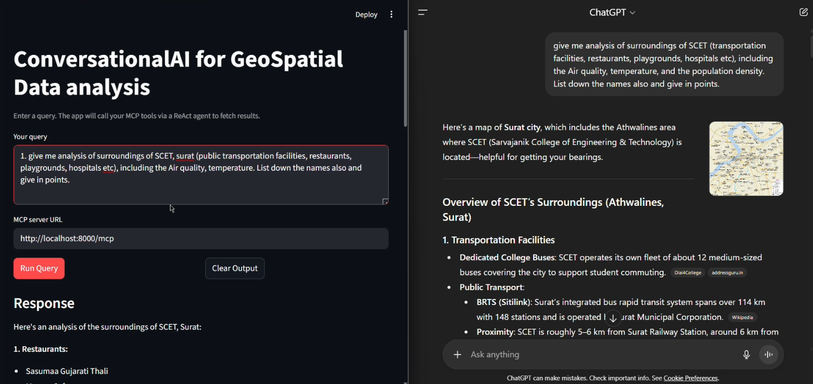
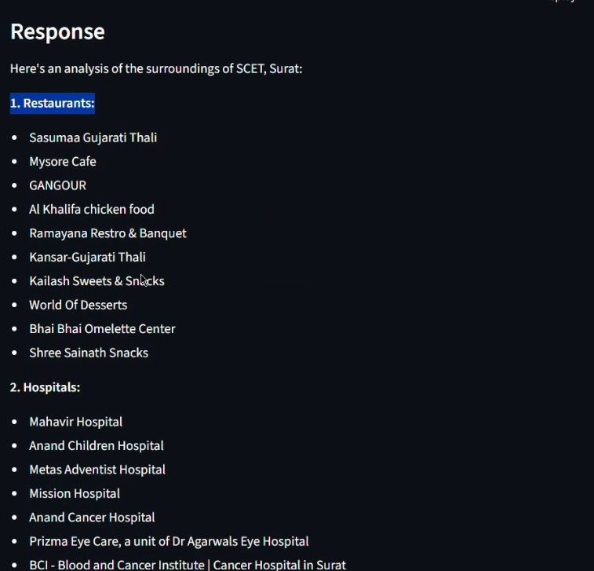
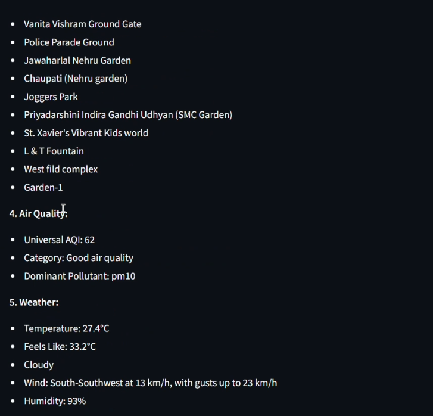
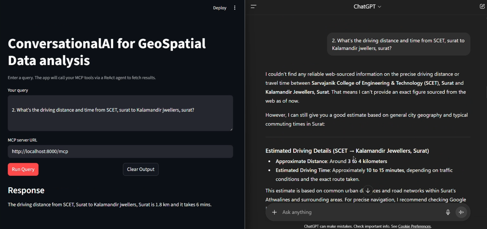
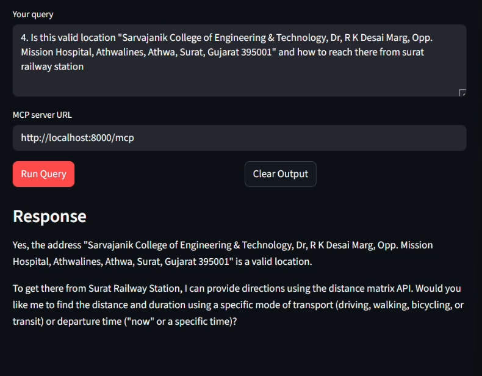

## Location Intelligence (MCP + LangChain + Streamlit)

Conversational AI for geospatial analysis using the Model Context Protocol (MCP), Google Maps Platform, and a ReAct agent. Ask location-related questions (nearby amenities, air quality, weather, distances, etc.) and get structured answers powered by MCP tools.

### Features
- **Streamlit UI** to enter natural language queries
- **MCP server** exposing tools for: web search, geocoding, air quality, weather, places search/nearby, distance matrix, geolocation, and area insights
- **ReAct agent** (LangGraph) orchestrating tool calls
- **Google Gemini** model via `langchain-google-genai`

### Project Structure
```
app.py                # Streamlit frontend
server.py             # MCP server exposing geospatial tools (streamable-http)
client.py             # Minimal example client invoking the agent via MCP
archive/              # Older/experimental server and client variants
docs/demo/project_demo.mp4  # Demo video
requirements.txt      # Python deps
```

### Prerequisites
- Python 3.12+
- Google API keys with relevant products enabled (see below)
- SerpAPI key (for web search)

### Required Environment Variables
Create a `.env` file in the project root with the following keys. The app and server will load them automatically via `python-dotenv`.

```env
# Google Generative AI (Gemini)
GOOGLE_API_KEY=your_gemini_api_key

# Google Maps Platform (enable the specific APIs you use)
GOOGLEMAPS_API_KEY=your_google_maps_api_key

# SerpAPI (web search)
SERPAPI_API_KEY=your_serpapi_key
```

Recommended Google Maps Platform APIs to enable for full functionality used by `server.py`:
- Places API (Text Search, Nearby Search, Place Details)
- Air Quality API
- Weather API
- Geolocation API
- Distance Matrix API

### Installation

Windows (Command Prompt):
```bat
cd D:\MCP_Demo
python -m venv .venv
.venv\Scripts\activate
pip install -r requirements.txt
```

PowerShell:
```powershell
cd D:\MCP_Demo
python -m venv .venv
.\.venv\Scripts\Activate.ps1
pip install -r requirements.txt
```

Note: A `mcp-venv` folder exists in the repo, but creating a fresh virtual environment per-machine is recommended.

### Running

1) Start the MCP server (streamable-http transport):
```bash
python server.py
```
This exposes MCP at `http://localhost:8000/mcp`.

2) Launch the Streamlit app:
```bash
streamlit run app.py
```

3) Use the UI:
- Enter a query like: “give me analysis of surroundings of Sarvajanik College of Engineering and Technology (public transportation facilities, restaurants, playgrounds, hospitals etc) including air quality and temperature.”
- Ensure the MCP server URL field is `http://localhost:8000/mcp`.

### CLI Example (optional)
`client.py` contains a minimal example showing how to connect to the MCP server and run a single prompt through the agent. Run it after starting `server.py`.

```bash
python client.py
```

### Demo Video
The demo video is included in the repository:
- `docs/demo/project_demo.mp4`

📹 **Watch the demo video** by clicking on the file above or [download it here](docs/demo/project_demo.mp4)

> **Note:** GitHub doesn't support video playback in README files. You can download the video file to watch it locally, or view it directly on GitHub by clicking the file link above.

### Screenshots

Here are some screenshots showcasing the project in action:

#### Comparision of our solution with ChatGPT


#### Example 1: Basic Query Response


#### Example 1: Detailed Analysis


#### Example 2: Location Analysis


#### Example 3: Comprehensive Results


These screenshots demonstrate the conversational AI interface and the types of geospatial analysis results you can expect from the system.

### How It Works (High level)
- `server.py` registers multiple MCP tools (web search, geocode, air quality, weather, places, distance matrix, geolocation, area insights) built on Google Maps Platform and SerpAPI.
- `app.py` creates a ReAct agent with LangGraph + Gemini and dynamically loads the MCP tools over the HTTP transport using `langchain-mcp-adapters`.
- The agent selects and calls tools to fulfill your natural language query and returns the final answer back to the UI.

### Troubleshooting
- Missing/invalid API keys → verify `.env` and that relevant Google APIs are enabled for your project.
- MCP server not reachable → confirm `server.py` is running and the URL matches `http://localhost:8000/mcp`.
- Streamlit errors about packages → run `pip install -r requirements.txt` inside your active virtual environment.

### License
Specify your license here (e.g., MIT). If unspecified, this project defaults to “All rights reserved.”


